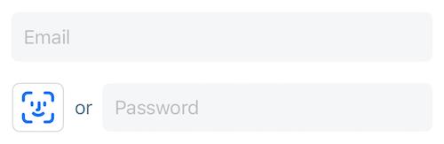

# OwnID Core iOS SDK - Custom Integration

The OwnID Core iOS SDK describes the way to integrate and use OwnID with custom identity platform.

The OwnID iOS SDK is a client library written in Swift that provides a simple way to add the "Skip Password" feature to the registration and login screens of your native application. For more general information about OwnID SDKs, see [OwnID iOS SDK](../README.md).

## Table of contents
* [Before You Begin](#before-you-begin)
* [Add Package Dependency](#add-package-dependency)
  + [Cocoapods](#cocoapods)
  + [Swift Package Manager](#swift-package-manager)
* [Enable Passkey Authentication](#enable-passkey-authentication)
* [Add Property List File to Project](#add-property-list-file-to-project)
* [Import OwnID Module](#import-ownid-module)
* [Initialize the SDK](#initialize-the-sdk)
* [Implement the Registration Screen](#implement-the-registration-screen)
  + [Customize View Model](#customize-view-model)
  + [Add the OwnID View](#add-the-ownid-view)
* [Implement the Login Screen](#implement-the-login-screen)
  + [Customize View Model](#customize-view-model-1)
  + [Add OwnID View](#add-ownid-view)
* [Tooltip](#tooltip)
* [Errors](#errors)
* [Advanced Configuration](#advanced-configuration)
  + [Logging Events](#logging-events)
  + [OwnID Environment](#ownid-environment)
  + [OwnID SDK Language](#ownid-sdk-language)
  + [Redirection URI Alternatives](#redirection-uri-alternatives)
  + [Alternative Syntax for Configure Function](#alternative-syntax-for-configure-function-)
  + [Button Apperance](#button-apperance)
  + [Manually Invoke OwnID Flow](#manually-invoke-ownid-flow)

## Before You Begin
Before incorporating OwnID into your iOS app, you need to create an OwnID application and integrate it with your project. For details, see [OwnID Custom Integration](https://docs.ownid.com/Integrations/custom-integration).

## Add Package Dependency

### Cocoapods

The SDK is distributed via Cocoapods. Use the Cocoapods to add the following package dependency to your project:

```
pod 'ownid-core-ios-sdk'
```

The OwnID iOS SDK supports Swift >= 5.1, and works with iOS 14 and above.

### Swift Package Manager

- In Xcode, select File > Swift Packages > Add Package Dependency.
- Follow the prompts using the URL for this repository.

## Enable Passkey Authentication

The OwnID SDK uses passkeys to authenticate users. To enable passkey support for your iOS app, associate your app with a website that your app owns using Associated Domains by following this guide: [Supporting associated domains](https://developer.apple.com/documentation/xcode/supporting-associated-domains).


## Add Property List File to Project

When the application starts, the OwnID SDK automatically reads `OwnIDConfiguration.plist` from the file system to configure the default instance that is created. At a minimum, this PLIST file defines a redirection URI and unique app id. Create `OwnIDConfiguration.plist` and define the following mandatory parameters:

```xml
<?xml version="1.0" encoding="UTF-8"?>
<!DOCTYPE plist PUBLIC "-//Apple//DTD PLIST 1.0//EN" "http://www.apple.com/DTDs/PropertyList-1.0.dtd">
<plist version="1.0">
<dict>
	<key>OwnIDAppID</key>
	<string>4tb9nt6iaur0zv</string>
</dict>
</plist>
```
Where:

- The `OwnIDAppID` is the unique AppID, which you can obtain from the [OwnID Console](https://console.ownid.com).
For additional configuration options, including environment configuration, see [Advanced Configuration](#advanced-configuration).

## Import OwnID Module
Once you have added the OwnID package dependency, you need to import the OwnID module so you can access the SDK features. As you implement OwnID in your project, add the following to your source files:

```swift
import OwnIDCoreSDK
```

## Initialize the SDK
The OwnID SDK must be initialized properly using the `configure()` function, preferably in the main entry point of your app (in the `@main` `App` struct). For example, enter:

```swift
@main
struct ExampleApp: App {
    init() {
        OwnID.CoreSDK.shared.configure()
    }
}
```

## Implement the Registration Screen
To make registration workig, you will need to provide your implementation of register process in your system.
In order to achieve this, supply register logic by implementing `RegistrationPerformer` protocol.

```swift
final class CustomRegistration: RegistrationPerformer {
    func register(configuration: OwnID.FlowsSDK.RegistrationParameters, parameters: RegisterParameters) -> AnyPublisher<OperationResult, OwnID.CoreSDK.Error> {
        let ownIdData = configuration.payload.dataContainer.rawDataForCustomFlow()
        return //Your register logic goes here
    }
}
```

When the user selects Skip Password, your app waits for events while the user interacts with the OwnID Web App, then calls your function to register the user once they have completed the Skip Password process.

### Customize View Model
The OwnID view that inserts the Skip Password UI is bound to an instance of the OwnID view model. Before modifying your View layer, create an instance of this view model, `OwnID.FlowsSDK.RegisterView.ViewModel`, within your ViewModel layer with `CustomRegistration` you created earlier:

```swift
final class MyRegisterViewModel: ObservableObject {
    // MARK: OwnID
    let ownIDViewModel = OwnID.FlowsSDK.RegisterView.ViewModel(registrationPerformer: CustomRegistration(),
                                                               sdkConfigurationName: clientName,
                                                               webLanguages: languages,
                                                               loginIdPublisher: loginIdPublisher)
}
```

After creating this OwnID view model, your View Model layer should listen to events from the OwnID Event Publisher, which allows your app to know what actions to take based on the user's interaction with the OwnID Web App. Simply add the following to your existing ViewModel layer to subscribe to the OwnID Event Publisher and respond to events (it can be placed just after the code that creates the OwnID view model instance).

```swift
final class MyRegisterViewModel: ObservableObject {
    // MARK: OwnID
    let ownIDViewModel = OwnID.FlowsSDK.RegisterView.ViewModel(registrationPerformer: CustomRegistration(),
                                                               sdkConfigurationName: clientName,
                                                               webLanguages: languages,
                                                               loginIdPublisher: loginIdPublisher)

    init() {
     subscribe(to: ownIDViewModel.eventPublisher)
    }

     func subscribe(to eventsPublisher: OwnID.RegistrationPublisher) {
       eventsPublisher
           .sink { [unowned self] event in
               switch event {
               case .success(let event):
                   switch event {
                   // Event when user successfully
                   // finishes Skip Password
                   // in OwnID Web App
                   case .readyToRegister:
                     // If needed, ask user to enter
                     // email (mandatory) and call
                     // OwnID.FlowsSDK.RegisterView.ViewModel.
                     // register(with email: String)
                     // to finish registration.
                     // This will prepare data and
                     // call your implementation of registration
                     ownIDViewModel.register()

                   // Event when OwnID creates
                   // account account in your system
                   // and logs in user
                   case .userRegisteredAndLoggedIn:
                     // User is registered and logged in with OwnID
                     
                   case .loading:
                     // Display loading indicator according to your designs
                   }

               case .failure(let error):
                // Handle OwnID.CoreSDK.Error here
               }
           }
           .store(in: &bag)
   }
}
```

**Important:** The OwnID `ownIDViewModel.register` function must be called in response to the `.readyToRegister` event. 

### Add the OwnID View
Inserting the OwnID view into your View layer results in the Skip Password option appearing in your app. When the user selects Skip Password, the SDK opens a sheet to interact with the user. The code that creates this view accepts the OwnID view model as its argument. It is suggested that you pass user's email binding for properly creating accounts.

It is reccomended to set height of button the same as text field and disable text field when OwnID is enabled. 

 

```swift
//Put RegisterView inside your main view, preferably besides password field
var body: some View {
    OwnID.FlowsSDK.RegisterView(viewModel: ownIDViewModel)
}
```

It is recommended that you hide `OwnID.FlowsSDK.RegisterView` when the user starts typing in the password text field. 

## Implement the Login Screen
To make login workig, you will need to provide your implementation of login process in your system.
In order to achieve this, supply login logic by implementing `LoginPerformer` protocol.

```swift
final class CustomLoginPerformer: LoginPerformer {
    func login(payload: OwnID.CoreSDK.Payload,
               email: String) -> AnyPublisher<OperationResult, OwnID.CoreSDK.Error> {
        let ownIdData = configuration.payload.dataContainer.rawDataForCustomFlow()
        return //Your login logic goes here
    }
}
```

The process of implementing your Login screen is very similar to the one used to implement the Registration screen. When the user selects Skip Password on the Login screen and if the user has previously set up OwnID authentication, allows them to log in with OwnID.

Like the Registration screen, you add Skip Password to your application's Login screen by including an OwnID view. In this case, it is `OwnID.LoginView`. This OwnID view has its own view model, `OwnID.LoginView.ViewModel`.

### Customize View Model
You need to create an instance of the view model, `OwnID.LoginView.ViewModel`, that the OwnID login view uses.

```swift
final class MyLogInViewModel: ObservableObject {
    // MARK: OwnID
    let ownIDViewModel = OwnID.FlowsSDK.LoginView.ViewModel(loginPerformer: CustomLoginPerformer(),
                                                            sdkConfigurationName: clientName,
                                                            loginIdPublisher: loginIdPublisher)
}
```

After creating this OwnID view model, you should listen to events from the OwnID Event Publisher, which allows your app to know what actions to take based on the user's interaction with the Skip Password option. Simply add the following to subscribe to the OwnID Event Publisher and respond to events.

```swift
final class MyLogInViewModel: ObservableObject {
    // MARK: OwnID
    let ownIDViewModel = OwnID.FlowsSDK.LoginView.ViewModel(loginPerformer: CustomLoginPerformer(),
                                                            sdkConfigurationName: clientName,
                                                            loginIdPublisher: loginIdPublisher)

 	  init() {
       subscribe(to: ownIDViewModel.eventPublisher)
   	}

     func subscribe(to eventsPublisher: OwnID.LoginPublisher) {
       eventsPublisher
           .sink { [unowned self] event in
               switch event {
               case .success(let event):
                   switch event {
                   // Event when user who previously set up
                   // OwnID logs in with Skip Password
                   case .loggedIn:
                     // User is logged in with OwnID

                   case .loading:
                     // Display loading indicator according to your designs
                   }

               case .failure(let error):
                 // Handle OwnID.CoreSDK.Error here
               }
           }
           .store(in: &bag)
   }
}
```

### Add OwnID View
Inserting the OwnID view into your View layer results in the Skip Password option appearing in your app. When the user selects Skip Password, the SDK opens a sheet to interact with the user. It is recommended that you place the OwnID view, `OwnID.LoginView`, immediately after the password text field. The code that creates this view accepts the OwnID view model as its argument. It is suggested that you pass user's email binding for properly creating accounts.

```swift
//Put LoginView inside your main view, preferably below password field
var body: some View {
  //...
  // User's email binding `$viewModel.email` is used to display identity
  // name when logging in. Additionally, this email is used to get
  // information if user already has OwnID account
  OwnID.FlowsSDK.LoginView(viewModel: ownIDViewModel, usersEmail: usersEmail) 
  //...
}
```

 

It is recommended that you hide `OwnID.FlowsSDK.LoginView` when the user starts typing in the password text field. 

## Tooltip

The OwnID SDK's `OwnIdButton` by default shows a Tooltip with text "Login with Face ID". 

 

On Registration you can setup the logic of tooltip appearing. By default it appears if the `loginId` text input is valid. Here how you can customize it 

```swift
ownIDViewModel.shouldShowTooltipLogic = false
```

`OwnIdButton` view has parameters to specify tooltip background color, border color, text color, text size, shadowColor and tooltip position `top`/`bottom`/`leading`/`trailing` (default `bottom`). You can change them by setting values in view attributes:

```swift
OwnID.GigyaSDK.createLoginView(viewModel: ownIDViewModel, visualConfig: OwnID.UISDK.VisualLookConfig(tooltipVisualLookConfig: OwnID.UISDK.TooltipVisualLookConfig(backgroundColor: .gray, borderColor: .black, textColor: .white, textSize: 20, tooltipPosition: .top)))
```

By default the tooltip has `zIndex(1)` to be above all other view. But if the OwnID View is inside some Stack and the tooltip is covered by another view it's recommended to set `zIndex(1)` for this stack

 ```swift
HStack {
    OwnID.GigyaSDK.createLoginView(viewModel: ownIDViewModel)
    SecureField("password", text: $password)
}
.zIndex(1)
```

## Errors
All errors from the SDK have an `OwnID.CoreSDK.Error` type. You can use them, for example, to properly ask the user to perform an action.

Here are these errors:

```swift
switch error {
case flowCancelled(let flow):
     print("flowCancelled")
     
 case userError(let errorModel):
     print("userError")
     
 case integrationError(underlying: Swift.Error):
     print("integrationError")
 }
}
```

Where: 

- flowCancelled(flow: FlowType) - Exception that occurs when user cancelled OwnID flow. Usually application can ignore this error. 
- userError(errorModel: UserErrorModel) - Error that is intended to be reported to end user. The userMessage string from UserErrorModel is localized based on OwnID SDK language and can be used as an error message for user. 
- integrationError(underlying: Swift.Error) - General error for wrapping Gigya errors OwnID integrates with.

## Advanced Configuration

### Logging Events

OwnID SDK has a Logger that is used to log its events. You can enable Xcode console & Console.app logging by calling `OwnID.CoreSDK.logger.isEnabled = true`. To use a custom Logger, call `OwnID.CoreSDK.logger.setLogger(CustomLogger(), customTag: "CustomTag")`

### OwnID environment

By default, the OwnID uses production environment for `appId` specified in configuration. You can set different environment. Possible options are: `uat`, `staging` and `dev`. Use `env` key in configuration json to specify required non-production environment:

```xml
<?xml version="1.0" encoding="UTF-8"?>
<!DOCTYPE plist PUBLIC "-//Apple//DTD PLIST 1.0//EN" "http://www.apple.com/DTDs/PropertyList-1.0.dtd">
<plist version="1.0">
<dict>
        <key>OwnIDAppID</key>
        <string>l16tzgmvvyf5qn</string>
        <key>OwnIDEnv</key>
        <string>uat</string>   
</dict>
</plist>
```

### OwnID SDK Language

By default, SDK uses language TAGs list (well-formed [IETF BCP 47 language tag](https://developer.mozilla.org/en-US/docs/Web/HTTP/Headers/Accept-Language)) based on the device locales set by the user in system. You can override this behavior and set the OwnID SDK language TAGs list manually. There are two ways to do so:

Optionally provide list of supported languages of `OwnID.CoreSDK.Languages` as `supportedLanguages` parameter.
```swift
OwnID.GigyaSDK.configure(supportedLanguages: ["he"])
``` 

Set language TAGs list directly:
```swift
OwnID.CoreSDK.setSupportedLanguages(["he"])
```

### Redirection URI Alternatives
The redirection URI determines where the user lands once they are done using their browser to interact with the OwnID Web App. You need to open your project and create a new URL type that corresponds to the redirection URL specified in `OwnIDConfiguration.plist`. 

```xml
<?xml version="1.0" encoding="UTF-8"?>
<!DOCTYPE plist PUBLIC "-//Apple//DTD PLIST 1.0//EN" "http://www.apple.com/DTDs/PropertyList-1.0.dtd">
<plist version="1.0">
<dict>
        <key>OwnIDAppID</key>
        <string>4tb9nt6iaur0zv</string>
        <key>OwnIDRedirectionURL</key>
        <string>com.myapp.demo://myhost</string>
</dict>
</plist>
```

In Xcode, go to **Info > URL Types**, and then use the **URL Schemes** field to specify the redirection URL. For example, if the value of the `OwnIDRedirectionURL` key is `com.myapp.demo://myhost`, then you could copy `com.myapp.demo` and paste it into the **URL Schemes** field.

### Alternative Syntax for Configure Function 🎛
If you followed the recommendation to add `OwnIDConfiguration.plist` to your project, calling `configure()` without any arguments is enough to initialize the SDK. If you did not follow this recommendation, you can still initialize the SDK with one of the following calls. Remember that these calls should be made within your app's `@main` `App` struct.

* `OwnID.GigyaSDK.configure(plistUrl: plist)` explicitly provides the path to the OwnID configuration file, where `plist` is the path to the file.
* `OwnID.GigyaSDK.configure(appID: String)` explicitly defines the configuration options rather than using a PLIST file. The app id is unique to your OwnID application, and can be obtained in the [OwnID Console](https://console.ownid.com). Additionally, you can use optional parameters and call `OwnID.GigyaSDK.configure(appID: config.OwnIDAppID, redirectionURL: config.OwnIDRedirectionURL, environment: config.OwnIDEnv)` The redirection URL is your app's redirection URL, including its custom scheme.

### Button Apperance
It is possible to set button visual settings by passing `OwnID.UISDK.VisualLookConfig`. Additionally, you can override default behaviour of tooltip appearing or other settings in `OwnID.UISDK.TooltipVisualLookConfig`.
By passing `widgetPosition`, `or` text view will change it's position accordingly. It is possible to modify look & behaviour of loader by modifying default settings of `loaderViewConfig` parameter.

```swift
let config = OwnID.UISDK.VisualLookConfig(buttonViewConfig: .init(iconColor: .red, shadowColor: .cyan),
                                          tooltipVisualLookConfig: .init(borderColor: .indigo, tooltipPosition: .bottom),
                                          loaderViewConfig: .init(spinnerColor: .accentColor, isSpinnerEnabled: false))
OwnID.GigyaSDK.createLoginView(viewModel: ownIDViewModel, visualConfig: config)
```

### Manually Invoke OwnID Flow
As alternative to OwnID button it is possible to use custom view to call functionality. In a nutshell, here it is the same behaviour from `ownIDViewModel`, just with your custom view provided.

Create simple `PassthroughSubject`. After you created custom view, on press send void action through this `PassthroughSubject`. In your `viewModel`, make `ownIDViewModel` to subscribe to this newly created publisher.

```swift
ownIDViewModel.subscribe(to: customButtonPublisher.eraseToAnyPublisher())
```

Additionally you can reset view by calling `ownIDViewModel.resetState()`.
