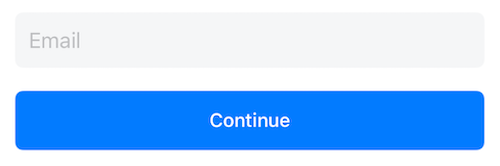
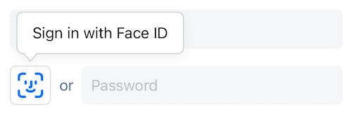

# OwnID Core iOS SDK - Direct Integration

The OwnID iOS SDK is a client library offering a secure and passwordless login alternative for your iOS applications. It leverages [Passkeys](https://www.passkeys.com) to replace conventional passwords, fostering enhanced authentication methods.

This document describes the way to directly integrate and use OwnID Core iOS SDK with your identity platform. The alternative way is [Custom Integration](sdk-custom-integration.md).

For more general information about OwnID SDKs, see [OwnID iOS SDK](../README.md).

## Table of contents
* [Before You Begin](#before-you-begin)
* [Add Package Dependency](#add-package-dependency)
  + [Cocoapods](#cocoapods)
  + [Swift Package Manager](#swift-package-manager)
* [Enable Passkey Authentication](#enable-passkey-authentication)
* [Add Property List File to Project](#add-property-list-file-to-project)
* [Import OwnID Module](#import-ownid-module)
* [Initialize the SDK](#initialize-the-sdk)
* [OwnID variants](#ownid-variants)
    * Boost
      * [Implement the Registration Screen](#implement-the-registration-screen)
        + [Add the OwnID View](#add-the-ownid-view)
        + [Customize View Model](#customize-view-model)
      * [Implement the Login Screen](#implement-the-login-screen)
        + [Add OwnID View](#add-ownid-view)
        + [Customize View Model](#customize-view-model-1)
    * Elite
      * [Run Elite](#run-elite)
         + [Create Providers](#create-providers)      
         + [Start the Elite](#start-the-elite)
* [Tooltip](#tooltip)
* [Credential enrollment](#credential-enrollment)
* [Errors](#errors)
* [Alternative Syntax for Configure Function](#alternative-syntax-for-configure-function)
* [Button Appearance](#button-appearance)

## Before You Begin

Before incorporating OwnID into your iOS app, you need to create an OwnID application in [OwnID Console](https://console.ownid.com) and integrate it with your identity platform. For details, see [OwnID documentation](https://docs.ownid.com/introduction).

## Add Package Dependency

### Cocoapods

The SDK is distributed via Cocoapods. Use the Cocoapods to add the following package dependency to your project:

```
pod 'ownid-core-ios-sdk'
```

### Swift Package Manager

- In Xcode, select File > Swift Packages > Add Package Dependency.
- Follow the prompts using the URL for this repository.

The OwnID iOS SDK supports Swift >= 5.1, and works with iOS 14 and above.

## Enable Passkey Authentication

The OwnID SDK uses passkeys to authenticate users. 

> [!IMPORTANT]
>
> To enable passkey support for your iOS app, associate your app with a website that your app owns using Associated Domains and add the associated domains entitlement to your app by following this guide: [Supporting associated domains](https://developer.apple.com/documentation/xcode/supporting-associated-domains).

## Add Property List File to Project

When the application starts, the OwnID SDK automatically reads `OwnIDConfiguration.plist` from the file system to configure the default instance that is created. At a minimum, this PLIST file defines the OwnID App Id - the unique identifier of your OwnID application, which you can obtain from the [OwnID Console](https://console.ownid.com). Create `OwnIDConfiguration.plist` and define the following mandatory parameters:

[Complete example](../Demo/DirectDemo/OwnIDConfiguration.plist)
```xml
<?xml version="1.0" encoding="UTF-8"?>
<!DOCTYPE plist PUBLIC "-//Apple//DTD PLIST 1.0//EN" "http://www.apple.com/DTDs/PropertyList-1.0.dtd">
<plist version="1.0">
<dict>
    <key>OwnIDAppID</key>
    <!--Replace with your App Id-->
    <string>gephu342dnff2v</string>
</dict>
</plist>
```

For additional configuration options, including environment configuration, see [Advanced Configuration](sdk-advanced-configuration.md).

## Import OwnID Module
Once you have added the OwnID package dependency, you need to import the OwnID module so you can access the SDK features. As you implement OwnID in your project, add the following to your source files:

[Complete example](../Demo/DirectDemo/DirectDemoApp.swift)
```swift
import OwnIDCoreSDK
```

## Initialize the SDK
The OwnID SDK must be initialized properly using the `configure(userFacingSDK:)` function, preferably in the main entry point of your app (in the `@main` `App` struct). Info is used in networks calls as part of `User Agent` string:

[Complete example](../Demo/DirectDemo/DirectDemoApp.swift)
```swift
@main
struct ExampleApp: App {
    init() {
        let info: OwnID.CoreSDK.SDKInformation = ("Integration", "3.x.x") //add you info here
        OwnID.CoreSDK.configure(userFacingSDK: info)
    }
}
```
If you did not follow the recommendation for creating the `OwnIDConfiguration.plist` file, you need to specify arguments when calling the `configure` function. For details, see [Alternative Syntax for Configure Function](#alternative-syntax-for-configure-function).

## OwnID variants

OwnID SDK offers two variants:
   + **Boost** - designed to enhance your existing login and registration forms by adding OwnID widget as an add-on.
   + **Elite** - provides predefined authentication screens that can be easily customized with your brand’s look and feel.

You can choose to integrate either or both.

<details open>
<summary><b>Boost</b></summary>

## Implement the Registration Screen
Within a Model-View-ViewModel (MVVM) architecture pattern, adding the Skip Password option to your registration screen is as easy as adding an OwnID view model and subscription to your app's ViewModel layer, then adding the OwnID view to your main View. That's it! When the user selects Skip Password, your app waits for events while the user interacts with the OwnID views, then calls a function to register the user once they have completed the Skip Password process.

### Add the OwnID View
Inserting the OwnID view into your View layer results in the OwnID button appearing in your app. The code that creates this view accepts the OwnID view model as its argument.

It is recommended to set height of button the same as text field and disable text field when OwnID is enabled.

[Complete example](../Demo/DirectDemo/RegisterView.swift)
```swift
//Put RegisterView inside your main view, preferably besides password field
var body: some View {
    OwnID.FlowsSDK.RegisterView(viewModel: ownIDViewModel, visualConfig: .init())
}
```

 

For additional OwnIDButton UI customization see [Button UI customization](#button-appearance).

### Customize View Model
The OwnID view that inserts the Skip Password UI is bound to an instance of the OwnID view model. Before modifying your View layer, create an instance of this view model, `OwnID.FlowsSDK.RegisterView.ViewModel`, within your ViewModel layer:

[Complete example](../Demo/DirectDemo/RegisterViewModel.swift)
```swift
final class MyRegisterViewModel: ObservableObject {
    @Published var loginId = ""
    
    var ownIDViewModel: OwnID.FlowsSDK.RegisterView.ViewModel!
    
    init() {
        ownIDViewModel = OwnID.FlowsSDK.RegisterView.ViewModel(loginIdPublisher: $loginId.eraseToAnyPublisher())
    }
}
```

Where `loginIdPublisher` provides input that user is typing into loginID field. See example of `@Published` property in demo app.

After creating this OwnID view model, your View Model layer should listen to flow events from the OwnID Flow Publisher, which allows your app to know what actions to take based on the user's interaction. Simply add the following to your existing ViewModel layer to subscribe to the OwnID Flow Publisher and respond to flow events (it can be placed just after the code that creates the OwnID view model instance).

[Complete example](../Demo/DirectDemo/RegisterViewModel.swift)
```swift
final class MyRegisterViewModel: ObservableObject {
    @Published var loginId = ""

    var ownIDViewModel: OwnID.FlowsSDK.RegisterView.ViewModel!
    private var bag = Set<AnyCancellable>()

    init() {
        ownIDViewModel = OwnID.FlowsSDK.RegisterView.ViewModel(loginIdPublisher: $loginId.eraseToAnyPublisher())
        subscribe(to: ownIDViewModel.flowEventPublisher)
    }

    func subscribe(to flowEventPublisher: OwnID.RegistrationFlowPublisher) {
        flowEventPublisher
            .receive(on: DispatchQueue.main)
            .sink { [unowned self] event in
                switch event {
                case .success(let event):
                    switch event {
                    // Event when user successfully finishes OwnID registration flow
                    case .response(let loginId, let payload, let authType):
                        // 1. Update your submit button to perform registration with OwnID data from this event
                        // 2. Collect any addition registration data from user
                        // 3. On submit button click register user with your identity platform and 
                        //    set OwnId Data (payload.data) to user profile
                     
                    case .loading:
                        // Display loading indicator according to your designs

                    case .resetTapped:
                        // Update submit button on tap action to run registration without OwnID data. 
                    }

                case .failure(let error):
                    // Handle OwnID.CoreSDK.Error here
                }
            }
            .store(in: &bag)
    }
}
```
> [!IMPORTANT]
>
> The OwnID `ownIDViewModel.register` function must be called in response to the `.readyToRegister` event. 

## Implement the Login Screen

The process of implementing your Login screen is very similar to the one used to implement the Registration screen. When the user selects Skip Password on the Login screen and if the user has previously set up OwnID authentication, allows them to log in with OwnID.

Like the Registration screen, you add Skip Password to your application's Login screen by including an OwnID view. In this case, it is `OwnID.LoginView`. This OwnID view has its own view model, `OwnID.LoginView.ViewModel`.

### Add OwnID View

Similar to the Registration screen, add the passwordless authentication to your application's Login screen by including one of OwnID button variants:

1. Side-by-side button: The `iconButton` that is located on the side of the password input field.
2. Password replacing button: The `authButton` that replaces password input field.

You can use any of this buttons based on your requirements.

1. Side-by-side button

    Inserting the OwnID view into your View layer results in the Skip Password option appearing in your app. When the user selects Skip Password, the SDK opens a sheet to interact with the user. It is recommended that you place the OwnID view, `OwnID.LoginView`, immediately after the password text field. The code that creates this view accepts the OwnID view model as its argument. It is suggested that you pass user's email binding for properly creating accounts.

    It is recommended to set height of button the same as text field and disable text field when OwnID is enabled.

    [Complete example](../Demo/DirectDemo/LogInView.swift)
    ```swift
    //Put LoginView inside your main view, preferably below password field
    var body: some View {
        OwnID.FlowsSDK.LoginView(viewModel: ownIDViewModel, visualConfig: .init())
    }
    ```

     
    
2. Password replacing button

    Add the following code to set up authButton:
    ```swift
    var body: some View {
        OwnID.FlowsSDK.LoginView(viewModel: ownIDViewModel, visualConfig: .init(widgetType: .authButton))
    }

 

For additional OwnIDButton UI customization see [Button Appearance](#button-appearance).

### Customize View Model
The OwnID view that inserts the Skip Password UI is bound to an instance of the OwnID view model. Before modifying your View layer, create an instance of this view model, `OwnID.FlowsSDK.RegisterView.ViewModel`, within your ViewModel layer:

[Complete example](../Demo/DirectDemo/LogInViewModel.swift)
```swift
final class MyLogInViewModel: ObservableObject {
    @Published var loginId = ""
    
    var ownIDViewModel: OwnID.FlowsSDK.LoginView.ViewModel!
    
    init() {
        ownIDViewModel = OwnID.FlowsSDK.LoginView.ViewModel(loginIdPublisher: $loginId.eraseToAnyPublisher())
    }
}
```

 Where `loginIdPublisher` provides input that user is typing into loginID field. See example of `@Published` property in demo app.

After creating this OwnID view model, you should listen to integration events from the OwnID Event Publisher, which allows your app to know what actions to take based on the user's interaction with the Skip Password option. Simply add the following to subscribe to the OwnID Event Publisher and respond to integration events.

[Complete example](../Demo/DirectDemo/LogInViewModel.swift)
```swift
final class MyLogInViewModel: ObservableObject {
    @Published var loginId = ""
    
    var ownIDViewModel: OwnID.FlowsSDK.LoginView.ViewModel!
    private var bag = Set<AnyCancellable>()

    init() {
        ownIDViewModel = OwnID.FlowsSDK.LoginView.ViewModel(loginIdPublisher: $loginId.eraseToAnyPublisher())
        subscribe(to: ownIDViewModel.flowEventPublisher)
    }

    func subscribe(to flowEventPublisher: OwnID.LoginFlowPublisher) {
        flowEventPublisher
            .receive(on: DispatchQueue.main)
            .sink { [unowned self] event in
                switch event {
                case .success(let event):
                    switch event {
                    case .response(let loginId, let payload, let authType):
                        // Login user with your identity platform using OwnId Data from this event (payload.data)
                    case .loading:
                        // Display loading indicator according to your designs
                    }

                case .failure(let error):
                    // Handle OwnID.CoreSDK.Error here
                }
            }
            .store(in: &bag)
    }
}
```
</details>

<details open>
<summary><b>Elite</b></summary>

## Run Elite

To implement passwordless authentication using the Elite in OwnID SDK, follow these three steps:

1. Create providers.
2. Start the Elite with event handlers.

### Create Providers

Providers manage critical components such as session handling and authentication mechanisms, including traditional password-based logins. They allow developers to define how users are authenticated, how sessions are maintained and how accounts are managed within the application.

You can define such providers:
1. **Session Provider**: Manages user session creation.
2. **Account Provider**: Handles account creation.
3. **Authentication Provider**: Manages various authentication mechanisms.
    1. Password-based authentication provider.

```swift
OwnID.providers {
    $0.session {
        $0.create { loginId, session, authToken, authMethod in
            // Create a user session using the provided data and return an AuthResult indicating success or failure.
        }
    }
    $0.account {
        $0.register { loginId, profile, ownIdData, authToken in
            // Register a new account with the given loginId and profile data.
            // Set ownIdData to the user profile if available.
            // Return an AuthResult indicating the outcome of the registration.
        }
    }
    $0.auth {
        $0.password {
            $0.authenticate { loginId, password in
                // Authenticate the user with the provided loginId and password.
                // Return an AuthResult to indicate success or failure.
            }
        }
    }
}
```

See [Complete example](../Demo/DirectDemo/WelcomeViewModel.swift)

### Start the Elite

To start a Elite, call the `start(_:)` function. You can define event handlers for specific actions and responses within the authentication flow. They allow to customize behavior when specific events occur. All event handlers are optional.

```swift
OwnID.start {
    $0.events { // All event handlers are optional.
        $0.onNativeAction { name, params in
            // Called when a native action is requested by other event handlers, such as `onAccountNotFound`.
            // Elite UI is currently closed or will be closed in a moment.
            // Run native actions such as user registration.
        }
        $0.onAccountNotFound { loginId, ownIdData, authToken in
            // Called when the specified account details do not match any existing accounts.
            // Use it to customize the flow if no account is found.
            // It should return a PageAction to define the next steps in the flow.
            //return OwnID.PageAction...
        }
        $0.onFinish { loginId, authMethod, authToken in
            // Called when the authentication flow successfully completes.
            // Elite UI is currently closed or will be closed in a moment.
            // Define post-authentication actions here, such as session management or navigation.
        }
        $0.onError { error in
            // Called when an error occurs during the authentication flow.
            // Elite UI is currently closed or will be closed in a moment.
            // Handle errors gracefully, such as logging or showing a message to the user.
        }
        $0.onClose {
            // Called when the authentication flow is closed, either by the user or automatically.
            // Elite UI is currently closed or will be closed in a moment.
            // Define any cleanup or UI updates needed.
        }
    }
}
```

See [Complete example](../Demo/DirectDemo/WelcomeViewModel.swift)

**Page Actions**
OwnID SDK provides two Page Actions to control the next steps in the Elite flow:
1. `OwnID.PageAction.close` - In response to this action the `onClose` event handler will be called.
2. `OwnID.PageAction.native(type: .register(loginId, ownIdData, authToken))` - In response to this action the `onNativeAction` event handler will be called with the action name "register" and parameters containing the `loginId`, `ownIdData`, and `authToken` encoded as a JSON string.

You can pass additional optional parameters to configure Elite WebView.

```swift
OwnID.start(options: OwnID.EliteOptions(webView: OwnID.EliteOptions.WebView(baseURL: "https://mysite.com", // Optional base URL for the WebView content
                                                                            html: "<html></html>"))) {     // Optional HTML content to be rendered in the WebView
    //...
}
```

</details>

## Tooltip

The OwnID SDK's `OwnIDButton` by default shows a Tooltip with text "Sign In with Fingerprint" / "Register with Fingerprint".

 

By default, tooltip is disabled

`OwnIDButton` view has parameters to specify tooltip - enable/disable, set background color, border color, font family, text color, text size and tooltip position `top`/`bottom`/`leading`/`trailing` (default `bottom`). You can change them by setting values in view attributes:

```swift
OwnID.FlowsSDK.LoginView(viewModel: ownIDViewModel, visualConfig: .init(iconButtonConfig: OwnID.UISDK.IconButtonViewConfig(tooltipConfig: OwnID.UISDK.TooltipConfig(isEnabled: true, tooltipPosition: .top, textSize: 20, textColor: .red, borderColor: .black, backgroundColor: .gray))))
```

By default the tooltip has `zIndex(1)` to be above all other view. But if the OwnID View is inside some Stack and the tooltip is covered by another view it's recommended to set `zIndex(1)` for this stack

 ```swift
HStack {
    OwnID.FlowsSDK.LoginView(viewModel: ownIDViewModel)
    SecureField("password", text: $password)
}
.zIndex(1)
```

## Credential enrollment

The credential enrollment feature allows users to enroll credentials outside of the login/registration flows. You can trigger credential enrollment on demand, such as after the user registers with a password.

There are 2 options to start the credential enrollment:

```swift
OwnID.CoreSDK.enrollCredential(loginIdPublisher: loginIdPublisher(),
                               authTokenPublisher: authTokenPublisher())
```
where `loginIdPublisher` is a publisher that emits user's login ID, `authTokenPublisher` is a publisher that emits user's authentication token. Both parameters should conform to the `AnyPublisher<String, Never>` type.

```swift
OwnID.CoreSDK.enrollCredential(loginId: String, authToken: String)
```
where `loginId` is a user's login ID, `authToken` is a user's authentication token.

Optionally, to monitor the status of the last credential enrollment request, you can listen to enrollment events:

```swift
OwnID.CoreSDK.enrollCredential(loginId: String, authToken: String)
    .receive(on: DispatchQueue.main)
    .sink { event in
        switch event {
        case .success:
            ...
        case .failure(let error):
            ...
        }
    }
    .store(in: &bag)
```

## Errors
All errors from the SDK have an `OwnID.CoreSDK.Error` type. You can use them, for example, to properly ask the user to perform an action.

Here are these errors:

[Complete example](../ownid-core-ios-sdk/Core/Sources/Types/CoreError.swift)
```swift
switch error {
case flowCancelled(let flow):
    print("flowCancelled")
     
case userError(let errorModel):
    print("userError")
     
case integrationError(underlying: Swift.Error):
    print("integrationError")
}
```

Where: 

- flowCancelled(flow: FlowType) - Exception that occurs when user cancelled OwnID flow. Usually application can ignore this error. 
- userError(errorModel: UserErrorModel) - Error that is intended to be reported to end user. The userMessage string from UserErrorModel is localized based on OwnID SDK language and can be used as an error message for user. 
- integrationError(underlying: Swift.Error) - General error for wrapping Integration errors OwnID integrates with.

## Alternative Syntax for Configure Function
If you followed the recommendation to add `OwnIDConfiguration.plist` to your project, calling `configure()` without any arguments is enough to initialize the SDK. If you did not follow this recommendation, you can still initialize the SDK with one of the following calls. Remember that these calls should be made within your app's `@main` `App` struct.

* `OwnID.CoreSDK.configure(plistUrl: URL, userFacingSDK: SDKInformation)` explicitly provides the path to the OwnID configuration file, where `plist` is the path to the file.
* `OwnID.CoreSDK.configure(appID: String, userFacingSDK: SDKInformation)` explicitly defines the configuration options rather than using a PLIST file. The app id is unique to your OwnID application, and can be obtained in the [OwnID Console](https://console.ownid.com). Additionally, you can use optional parameters and call `OwnID.CoreSDK.configure(appID: config.OwnIDAppID, redirectionURL: config.OwnIDRedirectionURL, userFacingSDK: info, environment: config.OwnIDEnv, enableLogging: config.enableLogging, supportedLanguages: ["he"])`. For more information about `redirectionURL`, `environment`, `enableLogging` and `supportedLanguages` parameters, see [Advanced Configuration](sdk-advanced-configuration.md).

## Button Appearance
It is possible to set button visual settings by passing `OwnID.UISDK.VisualLookConfig`. Additionally, you can override default behaviour of tooltip appearing or other settings in `OwnID.UISDK.TooltipVisualLookConfig`.
By passing `widgetPosition`, `or` text view will change it's position accordingly. It is possible to modify look & behaviour of loader by modifying default settings of `loaderViewConfig` parameter.

```swift
let orConfig = OwnID.UISDK.OrViewConfig(textSize: 20, textColor: .red)
let loaderConfig = OwnID.UISDK.LoaderViewConfig(spinnerColor: .red, circleColor: .green)
let tooltipConfig = OwnID.UISDK.TooltipConfig(tooltipPosition: .top,
                                              textSize: 30,
                                              textColor: .red,
                                              borderColor: .pink,
                                              backgroundColor: .blue)
let buttonConfig = OwnID.UISDK.IconButtonViewConfig(widgetPosition: .trailing,
                                                    height: 40,
                                                    iconColor: .red,
                                                    borderColor: .red,
                                                    backgroundColor: .white,
                                                    orViewConfig: orConfig,
                                                    loaderViewConfig: loaderConfig,
                                                    tooltipConfig: tooltipConfig)
let config = OwnID.UISDK.VisualLookConfig(iconButtonConfig: buttonConfig)

OwnID.FlowsSDK.LoginView(viewModel: ownIDViewModel, visualConfig: config)
```

if you want to change the `OwnIDButton` from side-by-side button to Password replacing button, use `widgetType = .authButton`

```swift
let loaderConfig = OwnID.UISDK.LoaderViewConfig(spinnerColor: .red, circleColor: .green)
let authButtonConfig = OwnID.UISDK.AuthButtonViewConfig(height: 50,
                                                        textSize: 20,
                                                        textColor: .red,
                                                        backgroundColor: .blue,
                                                        loaderHeight: 20,
                                                        loaderViewConfig: loaderConfig)
let config = OwnID.UISDK.VisualLookConfig(widgetType: .authButton, authButtonConfig: authButtonConfig)

OwnID.FlowsSDK.LoginView(viewModel: ownIDViewModel, visualConfig: config)
```
