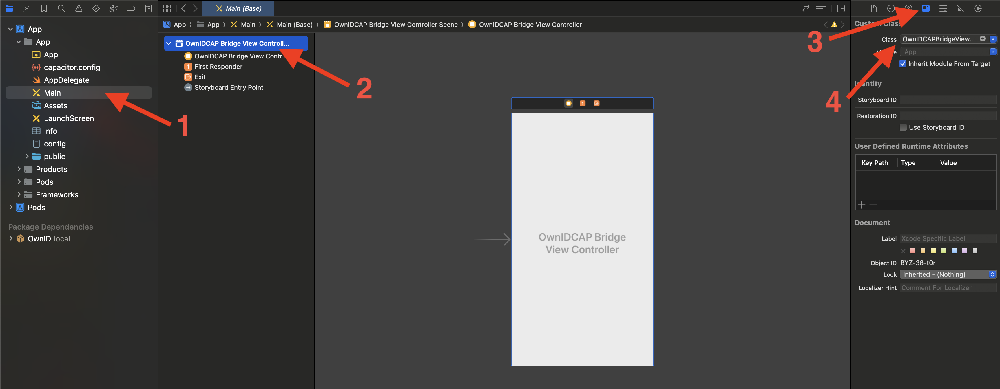

# OwnID iOS SDK WebView Bridge - WebView Integration

The OwnID iOS SDK WebView Bridge, an integral part of the OwnID Core iOS SDK, empowers the OwnID Web SDK to leverage the native capabilities of the OwnID iOS SDK. 

The bridge facilitates the injection of JavaScript code, enabling communication between the OwnID Web SDK and the native OwnID iOS SDK.

To get more information about the OwnID iOS SDK, please refer to the [OwnID iOS SDK](../README.md) documentation.

## Table of contents
* [Before You Begin](#before-you-begin)
* [WebView Bridge components](#webView-bridge-components)
* [Adding WebView Bridge](#adding-webview-bridge)
   + [Utilizing Prebuilt Integration-specific WebView Bridge](#utilizing-prebuilt-integration-specific-webview-bridge)
   + [Manual Integration of WebView Bridge](#manual-integration-of-webview-bridge)
* [Integration with Capacitor](#integration-with-capacitor)

---

## Before You Begin
Before incorporating OwnID iOS SDK WebView Bridge into your iOS application, ensure that you have already incorporated the OwnID iOS SDK. You can find step-by-step instructions in the [OwnID iOS SDK](../README.md) documentation.

Additionally, make sure you have integrated the [OwnID Web SDK is added into WebView](https://docs.ownid.com).

## WebView Bridge components

The OwnID iOS SDK WebView Bridge comprises the following components:

 - **Native Passkey Support**. 
 
Ensure that you enable passkey authentication in your iOS application by following the steps outlined in the Enable Passkey Authentication section of the OwnID documentation.

## Adding WebView Bridge
You have two primary options for integrating the OwnID WebView Bridge into your application:

### Utilizing Prebuilt Integration-specific WebView Bridge

Currently OwnID SDK provides prebuilt WebView Bridge for [OwnID Gigya iOS SDK](sdk-gigya.md#add-ownid-webview-bridge) for seamless integration with Gigya Web Screen-Sets with OwnID Web SDK.

### Manual Integration of WebView Bridge

To manually integrate the OwnID WebView Bridge into your WebView, follow these steps:

1. Create an instance of the OwnID iOS SDK. Detailed instructions can be found in the [OwnID iOS SDK](../README.md).

2. Inject the OwnID WebView Bridge into your Webview. This is typically done during the creation of the WebView and before loading its content.

```swift
let webBridge = OwnID.CoreSDK.createWebViewBridge()
webBridge.injectInto(webView: webView)
```

You can optionally specify either includeNamespaces or excludeNamespaces, or both, to customize the namespaces that will be used for the OwnIDWebBridge instance.
```swift
OwnID.CoreSDK.createWebViewBridge(includeNamespaces: [.FIDO])
```

## Integration with Capacitor

To integrate the OwnID WebView Bridge into your [Capaciptor](https://capacitorjs.com/) WebView, follow these steps:

1. Add the [OwnID iOS SDK](../README.md) to your native app based on your identity platform. Complete steps:
   * Add Package Dependency
   * Enable Passkey Authentication
   * Add Property List File to Project
   * Import OwnID Module
   * Initialize the SDK

2. Create a subclass of `CAPBridgeViewController` and add the OwnID WebView Bridge injection code in `viewDidLoad`:

```swift
final class OwnIDCAPBridgeViewController: CAPBridgeViewController {
    let webBridge = OwnID.CoreSDK.createWebViewBridge()
    
    override func viewDidLoad() {
        super.viewDidLoad()
        
        if let webView {
            // Specify any allowed origin rules for the WebView Bridge, in addition to server-configured values (if required)
            webBridge.injectInto(webView: webView, allowedOriginRules: ["yourscheme://your.domain.com"])
        }
    }
}
```

3. Change the initial view controller to the created subclass. By default, you can do it in `Main.storyboard`


