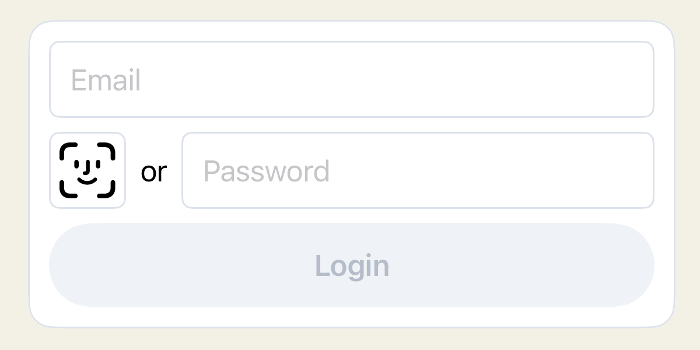
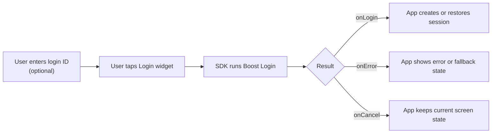
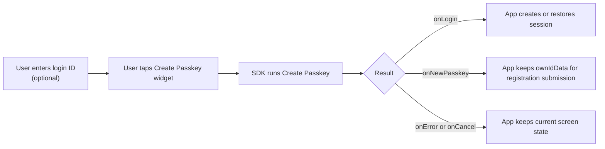

# Boost Flow

Boost Flow adds OwnID to an existing native login or account-creation form. The user stays in your app UI, taps an OwnID widget, and the SDK runs the recommended authentication or create-passkey path for that entry point.

Use Boost when the app keeps its current password login or registration form and adds OwnID as the passkey-first path next to it.

<picture>
  <source media="(prefers-color-scheme: dark)" srcset="../images/ios-boost-login-dark.png">
  <source media="(prefers-color-scheme: light)" srcset="../images/ios-boost-login-light.png">
  
</picture>

## Contents

- [Minimal Integration](#minimal-integration)
- [Examples](#examples)
- [Prerequisites](#prerequisites)
- [Flow Shape](#flow-shape)
- [Integration Details](#integration-details)
- [Widget Callbacks](#widget-callbacks)
- [Customization](#customization)
- [Security and Data Handling](#security-and-data-handling)

## Minimal Integration

### Login Widget Integration

Add [`OwnIDLoginWidget`](../../OwnIDSwiftUI/Sources/Widget/OwnIDLoginWidget.swift) next to the app's password field. Pass the same login ID value that the user edits in the form, then handle `onLogin`, `onError`, and `onCancel`.

```swift
import OwnIDCore
import OwnIDSwiftUI
import SwiftUI

struct LoginView: View {
    @State private var email = ""
    @State private var password = ""

    let onPasswordLogin: (String, String) -> Void
    let onOwnIDLogin: (BoostFlowLoginResponse) -> Void

    var body: some View {
        VStack(spacing: 12) {
            TextField("Email", text: $email)

            HStack(spacing: 8) {
                OwnIDLoginWidget(
                    onLogin: { response in
                        email = response.loginID.id
                        onOwnIDLogin(response)
                    },
                    loginID: email,
                    onError: { error in
                        // Show an app-owned error or fallback state and keep password login available.
                    },
                    onCancel: { reason in
                        // Keep the user on the login screen.
                    }
                )

                SecureField("Password", text: $password)
            }

            Button("Login") {
                onPasswordLogin(email, password)
            }
        }
    }
}
```

### Create-Passkey Widget Integration

Add [`OwnIDCreatePasskeyWidget`](../../OwnIDSwiftUI/Sources/Widget/OwnIDCreatePasskeyWidget.swift) to the registration form. Store the create-passkey response for registration submission.

```swift
import OwnIDCore
import OwnIDSwiftUI
import SwiftUI

struct RegisterView: View {
    @State private var name = ""
    @State private var email = ""
    @State private var password = ""
    @State private var createPasskeyResponse: BoostFlowCreatePasskeyResponse?

    let registerUser: (String, String, String, String?) -> Void
    let onOwnIDLogin: (BoostFlowLoginResponse) -> Void

    private var ownIdData: String? {
        guard
            let response = createPasskeyResponse,
            !email.isEmpty,
            email == response.loginID.id
        else {
            return nil
        }
        return response.ownIdData
    }

    var body: some View {
        VStack(spacing: 12) {
            TextField("Name", text: $name)
            TextField("Email", text: $email)

            HStack(spacing: 8) {
                OwnIDCreatePasskeyWidget(
                    onLogin: { response in
                        email = response.loginID.id
                        onOwnIDLogin(response)
                    },
                    onNewPasskey: { response in
                        email = response.loginID.id
                        createPasskeyResponse = response
                    },
                    onReset: {
                        createPasskeyResponse = nil
                    },
                    loginID: email,
                    onError: { error in
                        // Show an app-owned error or fallback state and keep manual registration available.
                    },
                    onCancel: { reason in
                        // Keep the current account-creation UI state.
                    }
                )

                SecureField("Password", text: $password)
            }

            Button("Submit") {
                registerUser(name, email, password, ownIdData)
            }
        }
    }
}
```

## Examples

- [Base login widget](../../Demo/DemoBase/App/Views/Boost/BoostLoginTab.swift)
- [Base create-passkey widget](../../Demo/DemoBase/App/Views/Boost/BoostCreatePasskeyTab.swift)
- [Advanced login widget example](../../Demo/DemoAdvanced/App/Views/Flows/Boost/BoostLoginScreen.swift)
- [Advanced create-passkey widget example](../../Demo/DemoAdvanced/App/Views/Flows/Boost/BoostCreatePasskeyScreen.swift)

## Prerequisites

- Add the SwiftUI SDK as described in [Install](../../README.md#install), initialize OwnID in [Configuration](../setup/configuration.md), and complete platform passkey setup in [Enable Passkeys](../../README.md#enable-passkeys).
- Register [`sessionCreate`](../setup/providers.md#session-create) if Boost login should return an app-defined session as `response.session`. Without an available provider, `onLogin` still receives `accessToken` and `sessionPayload`.
- Keep the existing password login and registration paths available next to the OwnID widgets.

## Flow Shape

### Login Flow Shape



### Create-Passkey Flow Shape



## Integration Details

Use these rules when wiring app state to Boost callbacks:

- **Login ID input:** Pass the same email, phone, or username value that the user edits in your form. The widget ignores blank values.
- **Returned login ID:** When `onLogin` or `onNewPasskey` returns, update the form from the response login ID. OwnID may normalize or resolve the value during the flow.
- **Password fallback:** Keep the app's password login or manual registration path available. If the user cancels or OwnID cannot complete, keep them on the same screen.
- **Create-passkey data:** Store the create-passkey response only while the form login ID still matches the response login ID. Submit `ownIdData` with registration only when it is present and still belongs to the current form value.
- **Changed form value:** If the user changes the email, phone, or username after `onNewPasskey`, clear the stored create-passkey response or ignore it until the login ID matches again.
- **No-proof result:** `onNewPasskey` can return without `ownIdData` when passkey creation is unavailable or fails. Continue with normal registration and do not submit OwnID proof data.

## Widget Callbacks

### Login Widget

- `onLogin`: Called when Boost login completes successfully. It receives [`BoostFlowLoginResponse`](../../OwnIDCore/Sources/Flow/Boost/BoostFlow.swift) with these fields:

  - `loginID`: Update the visible form value if the SDK resolved or normalized the login ID.
  - `authMethod`: Record or branch on the completed authentication method, such as passkey or OTP, when the app needs it.
  - `accessToken`: OwnID Access Token for app session handoff when needed.
  - `sessionPayload`: Server-provided payload for app session integration; also passed to [`sessionCreate`](../setup/providers.md#session-create) when that provider is available.
  - `session`: App-defined value returned by [`sessionCreate`](../setup/providers.md#session-create); `nil` when the provider is not configured or unavailable.

- `onError`: Called when Boost login fails. It receives [`BoostLoginFlowFailure`](../../OwnIDCore/Sources/Flow/Boost/BoostFlow.swift); branch on the concrete failure type for routing decisions, show app-owned retry or fallback UI, and keep password login available.
- `onCancel`: Called when the user closed the flow or the flow was canceled. It receives a `Reason`; keep the user on the same screen unless the app has a better fallback for that reason.

### Create-Passkey Widget

- `onLogin`: Called when OwnID recognizes and authenticates an existing user instead of creating a new account. It receives `BoostFlowLoginResponse`; see [Login Widget](#login-widget) for response fields.

The create-passkey widget can also complete successfully with a create-passkey response:

- `onNewPasskey`: Called when the widget has a create-passkey response for the current form value. It receives [`BoostFlowCreatePasskeyResponse`](../../OwnIDCore/Sources/Flow/Boost/BoostFlow.swift) with these fields:

  - `loginID`: Update the registration form and validate it before submit.
  - `proofToken`: Proof Token produced by passkey-related operations, or `nil` when no proof is available.
  - `ownIdData`: Submit with the registration request when present. Do not modify it.

- `onReset`: Called when the widget clears its completed create-passkey state. Clear the stored create-passkey response.
- `onError`: Called when the create-passkey flow fails. It receives [`BoostCreatePasskeyFlowFailure`](../../OwnIDCore/Sources/Flow/Boost/BoostFlow.swift); branch on the concrete failure type for routing decisions, show app-owned retry or fallback UI, and keep manual registration available.
- `onCancel`: Called when the user closed the flow or the flow was canceled. It receives a `Reason`; keep the user on the same screen unless the app has a better fallback for that reason.

### Common Failures

| Failure | What it usually means | Recommended handling |
| --- | --- | --- |
| `input(.unresolvedLoginID)` | Boost could not resolve a usable login ID from the form value, current context, or Access Token. | Let the user enter or correct the identifier and start a new Boost attempt. If the flow used an Access Token or context value, check that the supplied data contains a valid login ID. |
| `account(.blocked)` | The resolved account is blocked and cannot continue through this OwnID path. | Route the user to the app's blocked-account, recovery, or support path. Treat this as an expected account-state result, not as a retryable SDK failure. |
| `account(.notFound)` | This path expected an existing account, but none was found for the resolved login ID. | Route according to the screen: registration, another identifier entry path, or the app's normal account-not-found handling. Treat this as an expected account-state result. |
| `insufficientAuth` | Boost could not satisfy the required authentication checks with the operations available in this SDK setup. | Offer another app-level sign-in or registration path, or let the user start a new attempt later. If this is unexpected, check server auth requirements and configured SDK operations/providers. |
| `operationFailed` | A required SDK operation could not start, was unavailable, or failed while the flow was running. | End the current attempt and offer retry or another app-level path. Use `operationType`, nested `operationFailure`, and diagnostics to understand which SDK operation failed. |
| `sessionCreationFailed` | OwnID authentication completed, but the app's `sessionCreate` provider failed. | Show an app session/sign-in failure state and inspect the [`sessionCreate`](../setup/providers.md#session-create) provider. Do not treat this as failed OwnID authentication. |
| `unexpected` | The flow hit an unexpected SDK, runtime, or integration state. | Show a generic failure or retry state. Log diagnostics and retry only by starting a new Boost attempt. |

Use the failure's `errorCode` as a localization key when showing OwnID-related copy. Treat `message` and nested errors as diagnostics, not end-user text.

## Customization

The default widgets support theme, strings, showing OwnID before or after the `or` separator, icon button, checkmark, spinner, and separator text customization.

- For theme and palette setup, see [Themes and Colors](../customization/themes-and-colors.md).
- For SDK language setup, see [Configuration](../setup/configuration.md#language).
- For widget copy, see [Localization](../customization/localization.md).
- For deeper widget customization, see [Boost Widget Customization](../customization/boost-widgets.md).

## Security and Data Handling

- Treat `accessToken`, `sessionPayload`, and `ownIdData` as sensitive handoff values.
- Do not log passwords, provider tokens, OwnID Access Tokens, session payloads, or full authentication responses.
- Keep password login and manual registration available unless the product explicitly removes those fallbacks.
