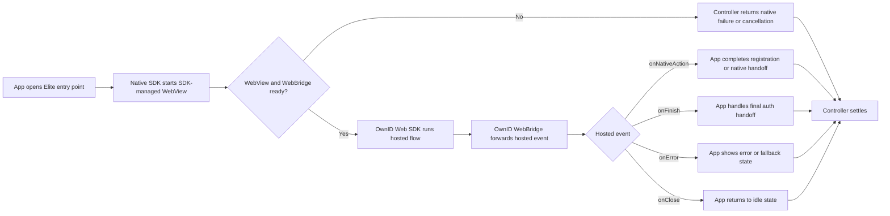

# Elite Flow

Elite Flow renders an OwnID-hosted page inside an SDK-managed WebView. The OwnID Web SDK runs the hosted authentication experience, and the native SDK forwards hosted-page events into Elite Flow callbacks through the [OwnID WebBridge](../integration/webbridge.md).

Use Elite when OwnID should own the primary authentication UI and your app only needs to handle final native handoff points.

## Minimal Integration

Start Elite Flow from the app entry point, keep the returned controller while the WebView flow is active, and handle final hosted events from [`EliteFlowContext.events`](../../OwnIDCore/Sources/Flow/Elite/EliteFlowContext.swift).

```swift
import OwnIDCore

@MainActor
final class EliteFlowCoordinator {
    struct PendingRegistration {
        let email: String
        let ownIdData: String?
    }

    private(set) var pendingRegistration: PendingRegistration?

    private var eliteFlowController: (any EliteFlowController)?

    deinit {
        eliteFlowController?.abort(reason: .userClose(details: "Elite Flow owner deinitialized"))
    }

    func startEliteFlow() {
        let context = EliteFlowContext { builder in
            builder.events { events in
                events.onNativeAction { [weak self] loginID, ownIdData, accessToken in
                    self?.pendingRegistration = PendingRegistration(email: loginID, ownIdData: ownIdData)
                    // accessToken is optional. Use it only if your app handoff needs it.
                }

                events.onFinish { loginID, authMethod, accessToken in
                    // Create or restore your app session.
                }

                events.onError { error in
                    // Show an app-owned error or fallback state.
                }

                events.onClose {
                    // Return the app UI to an idle state.
                }
            }
        }

        let controller = OwnID.flows.elite.start(context)
        eliteFlowController = controller

        Task { @MainActor [weak self] in
            await controller.whenSettled()
                .onSuccess {
                    // Functional completion was handled by one of the configured event handlers.
                }
                .onCanceled { reason in
                    // The app or SDK canceled before a hosted terminal event completed.
                }
                .onError { error in
                    // SDK/WebBridge failure before a hosted terminal event completed.
                }

            self?.eliteFlowController = nil
        }
    }

    func cancelEliteFlow() {
        eliteFlowController?.abort(reason: .userClose(details: "User canceled Elite Flow"))
        eliteFlowController = nil
    }
}
```

## Examples

- [Base Elite Flow ViewModel example](../../Demo/DemoBase/App/Views/Elite/EliteFlowViewModel.swift)
- [Base Elite Flow screen example](../../Demo/DemoBase/App/Views/Elite/EliteFlowScreen.swift)

## Prerequisites

- Add the Core SDK as described in [Install](../../README.md#install), initialize OwnID in [Configuration](../setup/configuration.md), and complete platform passkey setup in [Enable Passkeys](../../README.md#enable-passkeys).
- Register only the optional providers your hosted flow can use, such as [`sessionCreate`](../setup/providers.md#session-create), [`passwordAuthenticate`](../setup/providers.md#password-authenticate), and social sign-in providers like [Sign in with Google](../setup/providers.md#sign-in-with-google). For [Sign in with Apple](../setup/providers.md#sign-in-with-apple), complete the iOS capability and OwnID Console setup; it is built into `OwnIDCore` rather than registered as a provider.
- Keep the app's existing authentication, registration, and session paths available for native handoff, hosted errors, and user close.

## Flow Shape



## Handling Elite Flow Completion

Elite Flow has two signal layers. Hosted events come from the OwnID Web SDK and describe what happened in the hosted page. Controller results come from the native SDK and describe how the native WebView run settled.

### Hosted Events

Configure Elite Flow callbacks with `EliteFlowContext.events`.

| Callback | When it runs | App handling |
| --- | --- | --- |
| `onNativeAction` | The hosted page asks the native app to complete an app-owned native step, often registration. | Complete the app-owned native step. For registration, store the pending `loginID` and opaque `ownIdData`; submit and save `ownIdData` exactly as returned after registration succeeds. |
| `onFinish` | Hosted authentication completed successfully. | Complete the app authentication handoff at the app boundary. Use the optional Access Token only if your integration needs it. |
| `onError` | The hosted page reported an error. | Show an app-owned error or fallback state. Treat the optional error string as hosted-page context, not a native SDK failure. |
| `onClose` | The hosted page reported a close event. | Clear transient state and return to idle UI. Native user close or controller cancellation is reported through the controller result instead. |

All hosted event callbacks run on the main actor and are terminal after they return successfully. Then the SDK closes the WebView and the native controller settles successfully. If a handler fails, the hosted page receives a bridge error and the native run does not settle successfully from that event.

### Controller Result

The controller is a high-level handle for the running WebView flow. Keep it strongly referenced so the flow stays alive, use `abort(reason:)` for app-driven cancellation, and await `whenSettled()` for cleanup and for native cancellation or infrastructure failures.

The same flow instance is single-run: repeated `start(_:)` calls return the same controller and do not start another WebView run.

`whenSettled()` returns [`FlowResult<Void, EliteFlowFailure>`](../../OwnIDCore/Sources/Flow/Flow.swift). The failure type is declared in [`EliteFlowFailure`](../../OwnIDCore/Sources/Flow/Elite/EliteFlow.swift).

| Result | Meaning | App handling |
| --- | --- | --- |
| `.success` | A hosted terminal event handler returned successfully. | No payload is returned here. Continue from the state updated by the event handler. |
| `.canceled` | The app aborted the controller, the SDK shut down, or the WebView was canceled or detached before a hosted terminal event completed. | Clear the running controller and return to an idle or retry state. |
| `.failure` | The native SDK or WebBridge could not start or run, or the WebView failed before a hosted terminal event completed. | Show an error or fallback state and keep fallback authentication available. |

Use `FlowResult.failure` only for native SDK/WebBridge infrastructure failures:

| Failure | What it usually means | Recommended handling |
| --- | --- | --- |
| `operationFailed` | WebBridge was unavailable, could not start, or settled with a native failure. | End the current WebView attempt, keep another authentication path available, and inspect WebBridge configuration, allowed origin, native container/UI setup, and diagnostics. |
| `unexpected` | The native Elite flow stopped because of an unexpected SDK/runtime failure or internal invariant violation. | Show a generic fallback state, log diagnostics, and start a new attempt only after the app returns to a clean state. |

Use the failure's `errorCode` as a localization key when showing OwnID-related copy. Treat `message` and nested errors as diagnostics, not hosted-page business state.

## Customization

Use `EliteFlowContext.Builder.options` to configure SDK-managed WebView options for an Elite Flow session. Most integrations can leave these values unset and use server configuration plus SDK defaults. Set options only when the app needs to override hosted content inputs, WebView diagnostics, native container appearance, or app-bound-domain behavior for this specific flow.

```swift
import OwnIDCore
import UIKit

let context = EliteFlowContext { builder in
    builder.options { options in
        options.baseUrl = "https://webview.ownid.com"
        options.webViewIsInspectable = false
        options.backgroundColor = .white
        options.limitsNavigationsToAppBoundDomains = false
    }
}
```

Common options:

| Option | Use |
| --- | --- |
| `baseUrl` | Base URL used for the HTML page. Leave it unset to use server configuration, then the SDK fallback `https://webview.ownid.com`. |
| `userAgent` | Custom WebView User-Agent string. Leave it unset to use the SDK's default local User-Agent value. |
| `webViewIsInspectable` | Enables Safari Web Inspector where the platform supports it. Defaults to `false` when set through options; if options are omitted entirely, the SDK uses the app debuggable state. |
| `backgroundColor` | Native background color for the SDK-managed WebView container and safe-area regions. Leave it unset to use the SDK default, currently white. Hosted page colors still come from the hosted page. |
| `limitsNavigationsToAppBoundDomains` | Enables Apple's App-Bound Domains mode for this flow's managed WebView on iOS 14 and later. Defaults to `false`. The host app must also declare matching domains in `WKAppBoundDomains` in Info.plist; include the effective `baseUrl` host, such as `webview.ownid.com` when the SDK fallback is used. Do not include URL schemes, paths, queries, or fragments. See [Apple `WKWebViewConfiguration.limitsNavigationsToAppBoundDomains`](https://developer.apple.com/documentation/webkit/wkwebviewconfiguration/limitsnavigationstoappbounddomains) and [WebKit App-Bound Domains](https://webkit.org/blog/10882/app-bound-domains/) for platform behavior. |

When the default WebBridge integration is used, `baseUrl` is also added to the bridge allowed-origin set. Use an origin-shaped URL such as `https://example.com` without a path, query, or fragment unless you intentionally need page URL origin derivation.

## Security and Data Handling

- Treat `accessToken` and `ownIdData` as sensitive handoff values.
- Do not log provider tokens, OwnID Access Tokens, session payloads, `ownIdData`, or full hosted-event payloads.
- Keep fallback authentication available when the hosted page or native bridge cannot complete.
