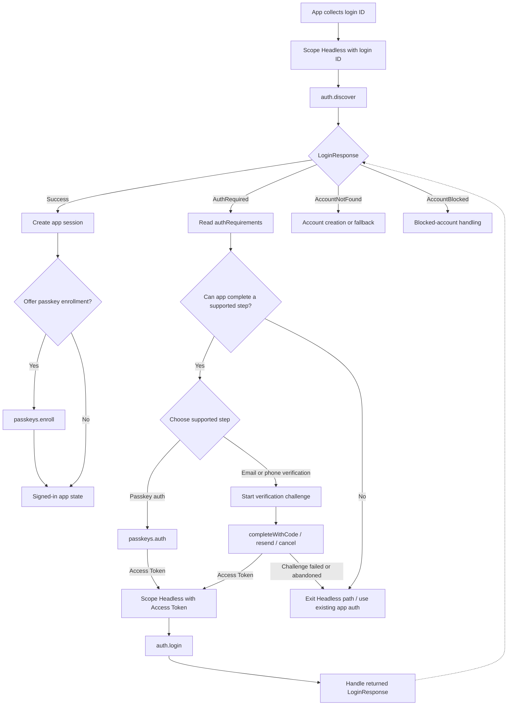

# Headless

## Overview

Headless integration lets your app own the user interface and authentication state machine while OwnID runs discovery, passkeys, verification, login, and passkey enrollment steps.

Use Headless when the app needs custom screens, navigation, analytics, loading states, fallback ordering, or registration/session handoff that is different from the SDK-managed flows.

## Contents

- [Examples](#examples)
- [Prerequisites](#prerequisites)
- [Flow Shape](#flow-shape)
- [Headless Entry Points](#headless-entry-points)
- [Login Flow Integration](#login-flow-integration)
- [Additional Authentication Requirements](#additional-authentication-requirements)
- [Supported Headless Steps](#supported-headless-steps)
- [Post-Login Passkey Enrollment](#post-login-passkey-enrollment)
- [API Failure Handling](#api-failure-handling)
- [Operation Failure Handling](#operation-failure-handling)
- [Security and Data Handling](#security-and-data-handling)
- [Related Documentation](#related-documentation)

## Examples

- [Base Headless example](../../Demo/DemoBase/App/Views/Headless)
- [Advanced Headless example](../../Demo/DemoAdvanced/App/Views/Headless)

## Prerequisites

- Add the Core SDK as described in [Install](../../README.md#install), initialize OwnID in [Configuration](../setup/configuration.md), and complete platform passkey setup in [Enable Passkeys](../../README.md#enable-passkeys).
- Decide which headless steps the app will support and build the matching app-owned UI: login ID collection, loading and error states, passkey authentication, email or phone verification, fallback, and optional passkey enrollment.
- Keep the app's existing authentication and session paths available: scope each attempt with [Context](../setup/context.md) and [Namespace Handles](../setup/namespace-handles.md), complete app login from [`LoginResponse.success`](../../OwnIDCore/Sources/Models/LoginID.swift), and route unsupported, canceled, or failed steps to fallback.

## Flow Shape



## Headless Entry Points

Use these `OwnID.headless` entries to compose the app-owned login flow:

- Start with `auth.discover.start()` from a login ID scope.
- If OwnID returns `LoginResponse.authRequired`, choose a supported operation from `authRequirements`.
- Continue with `auth.login.start()` after passkey authentication or verification returns an Access Token.
- Use `passkeys.enroll` only after successful authentication, when the app wants to offer passkey enrollment.
- Operation and flow entries return app-owned controllers; call `whenSettled()` for terminal [`OperationResult`](../../OwnIDCore/Sources/Operation/OperationCapability.swift) or [`FlowResult`](../../OwnIDCore/Sources/Flow/Flow.swift).
- Availability can report missing SDK setup before start; starting an entry can still fail if required SDK dependencies are unavailable.

| Entry | Result | Use |
| --- | --- | --- |
| `auth.discover.start()` | [`APIResult<LoginResponse, DiscoverAPIFailure>`](../../OwnIDCore/Sources/API/APICapability.swift) | Start from a login ID and receive the next login outcome. |
| `auth.login.start()` | `APIResult<LoginResponse, LoginAPIFailure>` | Continue after OwnID returns an `AccessToken`. |
| `passkeys.auth` | [`PasskeyAssertionOperationController`](../../OwnIDCore/Sources/Operation/PasskeyOperation.swift) | Authenticate with an existing passkey. |
| `verifications.email` | `APIResult<EmailVerificationAPIController, EmailVerificationStartAPIFailure>` | Start an email verification challenge. |
| `verifications.phone` | `APIResult<PhoneVerificationAPIController, PhoneVerificationStartAPIFailure>` | Start a phone verification challenge. |
| `passkeys.enroll` | [`PasskeyEnrollController`](../../OwnIDCore/Sources/Flow/Passkey/PasskeyEnrollFlow.swift) | Add a passkey after successful login from the current user's Access Token; the flow runs local passkey creation and server enrollment. See [Passkey Enrollment](passkey-enrollment.md). |

## Login Flow Integration

Scope the headless namespace with the login ID the user entered, discover the next login outcome, then handle each `LoginResponse` case. When additional authentication is required, run supported next steps until `auth.login.start()` returns `LoginResponse.success` or the app routes to fallback.

```swift
import OwnIDCore

func startHeadlessLogin(email: String) async {
    let headless = OwnID.headless.withContext { context in
        context.authz = .start(email, type: .email)
    }

    let result = await headless.auth.discover.start()
        .onError { _ in }
        .onCanceled {}

    guard let response = result.getOrNil() else { return }

    switch response {
    case .success(let success):
        await completeAppLogin(
            accessToken: success.accessToken,
            sessionPayload: success.sessionPayload
        )
    case .authRequired(let required):
        await continueAuth(required.authRequirements, headless: headless)
    case .accountNotFound(let notFound):
        showAccountNotFound(notFound.reason)
    case .accountBlocked(let blocked):
        showAccountBlocked(blocked.reason)
    }
}
```

Handle every `LoginResponse` case. `auth.login.start()` returns the same `LoginResponse` shape and should be handled with the same completeness.

Use `withContext` for per-attempt login IDs and Access Tokens:

```swift
let loginScoped = OwnID.headless.withContext { context in
    context.authz = .start(email, type: .email)
}

let tokenScoped = OwnID.headless.withContext { context in
    context.authz = .fromToken(accessToken)
}
```

## Additional Authentication Requirements

The `.authRequired` response carries `authRequirements` with:

- `targetScore`: the minimum cumulative score that must be reached;
- `operations`: server-provided recommended [`OperationRequirement`](../../OwnIDCore/Sources/Models/Operation.swift) items. Use each item's `type`, `score`, and optional `channels` to choose supported next steps.
- optional `channels` on operation requirements, such as available email or phone delivery choices.

Choose a next step from `operations` that this app can actually complete. If passkey authentication or verification returns an Access Token, call `auth.login`. If no supported Headless step can continue the attempt, leave the Headless path and use the app's existing authentication flow.

```swift
func continueAuth(_ requirements: AuthRequirements, headless: OwnIDHeadless) async {
    let types = Set(requirements.operations.map(\.type))

    if types.contains(.passkeyAuth),
       let accessToken = await runPasskeyAuth(headless: headless) {
        await finishLogin(accessToken: accessToken)
        return
    }

    if types.contains(.emailVerification) {
        await runEmailVerification(headless: headless)
    } else if types.contains(.phoneNumberVerification) {
        await runPhoneVerification(headless: headless)
    } else {
        showFallback()
    }
}
```

## Supported Headless Steps

### Passkey Authentication

Run `passkeys.auth` only when `.passkeyAuth` is present in the current requirements.

OwnID passkey operations delegate to Apple's AuthenticationServices framework. Availability and runtime results depend on iOS version, entitlements, provisioning profile, AASA/domain setup, tenant configuration, and available credentials.

Check availability, start the operation, keep the controller strongly referenced until settlement, and finish login with the returned Access Token. A local controller is enough only when the calling task owns the whole step; otherwise keep it in owner state and call `abort(reason:)` when the owner cancels or is torn down.

```swift
func runPasskeyAuth(headless: OwnIDHeadless) async -> AccessToken? {
    let passkeyAuth = headless.passkeys.auth

    var isAvailable = false
    await passkeyAuth.availability()
        .onAvailable { isAvailable = true }
        .onUnavailable { _ in }

    guard isAvailable else { return nil }

    let controller = passkeyAuth.start()
    // Keep in owner state if the step can outlive this task.
    // Abort it on teardown.
    return await controller.whenSettled()
        .getOrNil()
}

func finishLogin(accessToken: AccessToken) async {
    let result = await OwnID.headless
        .withContext { context in context.authz = .fromToken(accessToken) }
        .auth.login
        .start()

    // Route the LoginResponse result through the app auth/session boundary.
}
```

### Email and Phone Verification

Email and phone verification use the same controller pattern: start a challenge, render `controller.challenge`, then call `completeWithCode`, `resend`, or `cancel`. The challenge carries the delivery destination in `controller.challenge.channel.channel`, OTP configuration in `controller.challenge.methods`, and resend rules in `controller.challenge.resendPolicy`.

- Use `verifications.email` for `.emailVerification` and `verifications.phone` for `.phoneNumberVerification`.
- For an email or phone login ID, start the matching verification from the login ID scoped to the current Headless attempt.
- For a username login ID, choose an email or phone channel from the matching `OperationRequirement.channels`, start the matching verification with explicit params, and pass the selected channel `id` as `loginIDHintID`.
- Verification completion returns [`AccessOrProofToken`](../../OwnIDCore/Sources/Models/Tokens.swift). In the login `.authRequired` path, continue only with an `.accessToken`: call `auth.login` with `.fromToken(accessToken)`. Treat a `.proofToken` result as unsupported for this login attempt.
- Complete, resend, and cancel failures belong to the current verification challenge. Keep the controller only while retry or resend is still valid for that challenge; otherwise cancel or restart from a fresh challenge. Releasing the controller reference does not cancel the server challenge; call `controller.cancel(reason:)` when the user abandons it.

```swift
@MainActor
final class EmailVerificationCoordinator: ObservableObject {
    private var controller: (any EmailVerificationAPIController)?

    func start(headless: OwnIDHeadless) async {
        let result = await headless.verifications.email.start()
            .onError { _ in }
            .onCanceled {}

        guard let controller = result.getOrNil() else { return }
        self.controller = controller
        // Render controller.challenge.
    }

    func complete(code: String) async -> AccessToken? {
        guard let controller else { return nil }
        var accessToken: AccessToken?

        await controller.completeWithCode(code: code)
            .onSuccess { result in
                self.controller = nil
                switch result {
                case .accessToken(let token):
                    accessToken = token
                case .proofToken:
                    showFallback()
                }
            }
            .onError { error in
                if case .badRequest(.wrongCode) = error {
                    // Keep this challenge active and show an OTP error.
                } else {
                    // Invalid, expired, completed, or max-attempt challenges need a fresh start.
                    self.controller = nil
                }
            }

        return accessToken
    }

    func resend() async {
        guard let controller else { return }
        await controller.resend()
    }

    func cancel() async {
        guard let controller else { return }
        await controller.cancel(reason: .userClose())
        self.controller = nil
    }
}
```

## Post-Login Passkey Enrollment

Use Passkey Enrollment after successful authentication, when the app has an Access Token for the signed-in user and a reason to offer a new passkey. Good signals from the current Headless attempt's `LoginResponse.authRequired.authRequirements` are:

- No passkey authentication step was offered.
- Passkey authentication was offered, but no applicable credential was available and the user completed login through another supported step.

Start `passkeys.enroll` from an Access Token scope for the current user. The enrollment flow handles local passkey creation and server enrollment internally. Check availability before enabling the add-passkey action and follow [Passkey Enrollment](passkey-enrollment.md).

## API Failure Handling

Direct API calls report handled endpoint failures through typed failure values. Branch on the endpoint-specific failure type first; use `errorCode` only as a localization key when showing OwnID-related copy.

The table below covers failures returned by the Headless direct API entries and verification controllers. Account state and additional-auth requirements are returned as `LoginResponse`, not as API failures.

| API step | Common failure groups | App handling |
| --- | --- | --- |
| `auth.discover.start()` and `auth.login.start()` | Invalid or unsupported login ID or token input, forbidden access, failed or missing server-side providers, unexpected failures. | Fix invalid input before retrying. For failed or missing server-side providers, inspect the provider/capability setup and backend integration before retrying. Handle `.authRequired`, `.accountNotFound`, and `.accountBlocked` from `LoginResponse`, not as API failures. |
| `verifications.email.start()` and `verifications.phone.start()` | Invalid login ID, unsupported login ID type, missing channel, forbidden access, user not found, failed or missing server-side providers, maximum active challenges, unexpected failures. | Keep the selected auth step explicit. Let the user correct invalid identifiers, choose another available channel or method when a channel is missing, route user-not-found to account creation, and avoid starting duplicate challenges when the server reports challenge limits. |
| `completeWithCode` on a verification controller | Wrong code, invalid challenge, maximum attempts, forbidden access, unexpected failures. | Wrong codes stay within the current challenge while attempts remain. Invalid, expired, completed, or max-attempt challenges require clearing local challenge state and starting a fresh challenge. |
| `resend` on a verification controller | Invalid challenge, maximum resend limit or debounce, failed or missing server-side providers, unexpected failures. | Disable or delay resend according to the current challenge policy. If the challenge is invalid, expired, or completed, clear local state and start a new challenge instead of retrying the same controller. |
| `cancel` on a verification controller | Invalid challenge, maximum attempts, unexpected failures. | Clear local challenge state when the user abandons the step. If cancel fails because the challenge is already invalid, completed, or exhausted, do not keep using that controller. |

## Operation Failure Handling

In this Headless flow, `passkeys.auth` is the operation entry that settles through `OperationResult<AccessToken, PasskeyAssertionOperationFailure>`. `OperationResult.canceled` means the user dismissed passkey UI, the challenge timed out, or the system ended the passkey-auth attempt before it completed; clear the active controller and offer another supported step or exit Headless to the app fallback.

For `OperationResult.failure`, branch on `PasskeyAssertionOperationFailure` first. These categories summarize passkey-auth failures:

| Failure category | Meaning | App handling |
| --- | --- | --- |
| `input` | A resolvable login ID or Access Token was missing, the login ID was invalid or unsupported, or the request shape was invalid. | Fix the scoped context or explicit params before retrying. If the login ID cannot be supported, use another auth path. |
| `challenge` | The passkey assertion challenge could not be started or verified, or its limits were reached. | Do not keep retrying the same challenge. Start a new passkey-auth operation only when the user retries; otherwise offer another supported step or exit Headless to the app fallback. |
| `access` | The user/account/token state does not allow passkey authentication, such as forbidden or user-not-found responses. | Route through app account-state handling: re-authentication, account creation, support, or another app-owned path. |
| `credential` | AuthenticationServices reported that no matching passkey credential is available for this assertion request. | Let the user retry platform passkey UI, choose another supported Headless step, or exit Headless to the app fallback. |
| `integration` | Required SDK setup, login ID validation, platform passkey provider, or server-side provider/capability failed or is missing. | Keep fallback auth available and inspect SDK setup, passkey/domain configuration, server-side provider configuration, and platform diagnostics before retrying. |
| `unexpected` | The SDK, runtime, transport, or response mapping failed outside expected passkey-auth paths. | Show a generic retry/fallback state and log diagnostics. Start a new operation only after the user retries. |

## Security and Data Handling

- Treat Access Token, Proof Token, `sessionPayload`, verification codes, challenge data, and platform credential payloads as sensitive authentication handoff values.
- Do not log passwords, verification codes, tokens, full API or provider responses, raw credential payloads, or full controller/flow results.
- Keep verification, operation, and flow controllers scoped to the current Headless attempt. Cancel or abort active work when the user abandons a step, and clear stale controllers after settlement.
- Headless does not replace the app session boundary. Create or refresh the app session only from `LoginResponse.success`, and keep fallback authentication explicit when a Headless step is unavailable, canceled, or fails.

## Related Documentation

- [Configuration](../setup/configuration.md)
- [Context](../setup/context.md)
- [Namespace Handles](../setup/namespace-handles.md)
- [Providers](../setup/providers.md)
- [Passkey Enrollment](passkey-enrollment.md)
