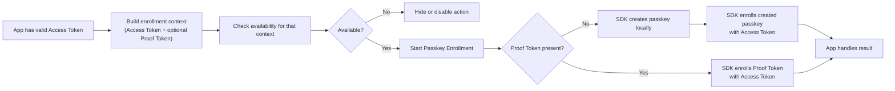

# Passkey Enrollment

Passkey Enrollment adds a passkey for a user who is already signed in to your app. In this guide, a signed-in user means your app has a valid OwnID Access Token for the current user.

Use this flow from account security, a post-login prompt, or a registration completion screen.

## Minimal Integration

Use the current user's Access Token, check availability before enabling enrollment, then keep the returned controller until the flow settles.

```swift
import Combine
import OwnIDCore

@MainActor
final class AccountViewModel: ObservableObject {
    private var controller: (any PasskeyEnrollController)?
    private var enrollmentTask: Task<Void, Never>?

    deinit {
        controller?.abort(reason: .userClose())
        enrollmentTask?.cancel()
    }

    func enrollPasskey(accessToken: AccessToken) {
        guard enrollmentTask == nil else { return }

        enrollmentTask = Task { @MainActor [weak self] in
            defer { self?.enrollmentTask = nil }

            let passkeyEnroll = OwnID.headless
                .withContext { context in context.authz = .fromToken(accessToken) }
                .passkeys.enroll

            let availability = await passkeyEnroll.availability()
                .onUnavailable { message in
                    // Hide or disable the action.
                    // Use message for integration diagnostics; do not show it as end-user copy.
                }

            guard case .available = availability else {
                return
            }

            let controller: any PasskeyEnrollController
            do {
                guard let self else { return }
                controller = passkeyEnroll.start()
                self.controller = controller
            }

            await controller.whenSettled()
                .onSuccess { response in
                    // response.loginID identifies the user whose passkey was enrolled.
                }
                .onCanceled { reason in
                    // User closed platform UI or the flow was canceled.
                }
                .onError { error in
                    // Show a retryable error or log diagnostics.
                }

            self?.controller = nil
        }
    }
}
```

## Examples

- [Current-user enrollment ViewModel](../../Demo/DemoBase/App/Views/CurrentUser/CurrentUserViewModel.swift)
- [Current-user enrollment screen](../../Demo/DemoBase/App/Views/CurrentUser/CurrentUserScreen.swift)
- [Headless enrollment after login](../../Demo/DemoBase/App/Views/Headless/HeadlessViewModel.swift)
- [Advanced passkey examples](../../Demo/DemoAdvanced/App/Views/Headless/HeadlessViewModel.swift)

## Prerequisites

- Add the Core SDK as described in [Install](../../README.md#install), initialize OwnID in [Configuration](../setup/configuration.md), and complete platform passkey setup in [Enable Passkeys](../../README.md#enable-passkeys).
- Start enrollment only after your app has a valid OwnID Access Token for the current user. Pass it in [`PasskeyEnrollFlowContext`](../../OwnIDCore/Sources/Flow/Passkey/PasskeyEnrollFlowContext.swift), or provide it through the current OwnID context with `withContext` or `setContext`; see [Context](../setup/context.md).
- Keep the current app session and account/security UI available for unavailable, canceled, or failed enrollment attempts.

## Flow Shape



## Integration Details

Use Passkey Enrollment from a signed-in account UI. The flow requires an Access Token for the current user and can optionally take a Proof Token when a previous OwnID step already produced proof for enrollment.

### Context and Availability

Availability is branch-specific. Build the enrollment context for the attempt first, then use that same context for both `availability(...)` and `start(...)`.

| Context | Availability checks | `start(...)` behavior |
| --- | --- | --- |
| `accessToken` | Preflight for SDK dependencies and required input on the local passkey-creation path. | Creates a passkey locally, then enrolls it with the Access Token. |
| `accessToken` + `proofToken` | Preflight for enrollment dependencies and required tokens. | Skips local passkey creation and enrolls the Proof Token. |
| No Access Token | Unavailable before enrollment can start. | Do not start enrollment from signed-out state. |

Availability is a preflight check, not a completion guarantee. Platform passkey UI, device or provider state, and backend token validation can still fail or cancel after `start(...)`.

Use `isAvailable(...)` when you only need a Boolean. Use `availability(...).onUnavailable { message in ... }` when you want the SDK diagnostic reason for integration logging; do not show that message as end-user copy.

### Enrollment Paths

- **Create and enroll passkey:** Use `accessToken` when the current user should create a new passkey on the device. The SDK runs local passkey creation, so platform passkey UI can appear, then consumes the local proof internally and enrolls the created passkey with the Access Token. Success returns `FlowResult.success` with `PasskeyEnrollFlowResponse.loginID`; `ownIdData` is not returned.

- **Enroll existing proof:** Use `accessToken` plus `proofToken` when a previous OwnID step already returned the Proof Token needed to enroll the passkey. The SDK skips local passkey creation and enrolls the Proof Token with the Access Token. Success returns `FlowResult.success` with `PasskeyEnrollFlowResponse.loginID`.

```swift
let context = PasskeyEnrollFlowContext { builder in
    builder.accessToken = accessToken

    // Optional. Set only when a previous OwnID step already returned a Proof Token.
    // When set, availability and start use the server-enrollment path.
    builder.proofToken = proofToken
}

let passkeyEnroll = OwnID.headless.passkeys.enroll

let availability = await passkeyEnroll.availability(context)
// If available, start with the same context:
// let controller = passkeyEnroll.start(context)
```

## Controller Ownership

A Passkey Enrollment controller represents one enrollment attempt for the current signed-in user. Keep the `PasskeyEnrollController` strongly referenced until `whenSettled()` returns.

If the owning screen or view model is torn down before settlement, call `abort(reason:)`. After settlement, clear the stored controller and update the account/security UI from the result.

Start a new enrollment attempt only after the previous controller has settled.

## Results and Error Handling

`whenSettled()` returns [`FlowResult<PasskeyEnrollFlowResponse, PasskeyEnrollFlowFailure>`](../../OwnIDCore/Sources/Flow/Flow.swift). The response and failure types are declared in [`PasskeyEnrollFlow`](../../OwnIDCore/Sources/Flow/Passkey/PasskeyEnrollFlow.swift).

| Result | Meaning | App handling |
| --- | --- | --- |
| `FlowResult.success` | Server enrollment completed for the returned `loginID`. | Refresh the account/security UI for that user and mark passkey enrollment complete. |
| `FlowResult.canceled` | The user, app, SDK scope, or platform passkey UI ended the attempt before server enrollment completed. | Clear the running controller, keep the current app session intact, and let the user retry when appropriate. |
| `FlowResult.failure` | The flow could not resolve required input, start or complete a required passkey step, or hit an unexpected SDK/runtime state. | Keep the current app session intact, branch on `PasskeyEnrollFlowFailure`, and show app-owned retry or fallback UI. |

For `FlowResult.failure`, branch on `PasskeyEnrollFlowFailure`:

| Failure | What it usually means | Recommended handling |
| --- | --- | --- |
| `input(.missingAccessToken)` | Enrollment was started without an OwnID Access Token for the current signed-in user. | Do not continue this attempt. Require a valid signed-in user context before showing or starting passkey enrollment. |
| `input(.unresolvedLoginID)` | The Access Token was present, but the SDK could not resolve a usable `loginID` from it. | Stop this attempt. Check token contents, token forwarding, and login ID validation setup; ask the user to re-authenticate only when the app cannot recover the current session cleanly. |
| `operationFailed` | A required passkey creation or enrollment step could not start, was unavailable, or failed. | Keep the account/security UI usable. Offer retry or another security method, and inspect `operationType`, `operationID`, `operationFailure`, `underlyingError`, and `message` when routing or troubleshooting needs more detail. |
| `unexpected` | The flow hit an SDK/runtime error or internal invariant outside expected input, cancellation, or passkey operation failure paths. | End the attempt, show a generic retry/fallback state, and log diagnostics. Start a new attempt only from a clean UI state. |

Use the failure's `errorCode` as a localization key when showing OwnID-related copy. Treat `message` and nested errors as diagnostics, not end-user text.

## Security and Data Handling

- Treat Access Token and Proof Token values as sensitive authentication handoff values.
- Do not log tokens, platform credential payloads, provider payloads, or full flow results.
- Passkey Enrollment does not create, refresh, or replace the app session. Keep the current app session explicit and intact when enrollment succeeds, is canceled, or fails.
- The flow returns the enrolled `loginID` only. It consumes local attestation proof internally and does not return `ownIdData`.
