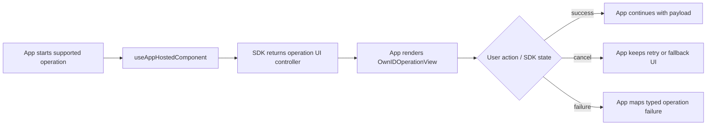

# App-Hosted Operation UI

Use app-hosted operation UI when the app owns where a supported OwnID operation appears, but still wants the SDK to drive operation state, validation, resend, cancellation, and settlement.

This applies to login ID collection, email verification, and phone verification. If the SDK should present its default UI container, start the operation directly without [`useAppHostedComponent`](../../OwnIDSwiftUI/Sources/OwnIDOperationUIHosting.swift).

## Contents

- [Minimal Integration](#minimal-integration)
- [Examples](#examples)
- [Prerequisites](#prerequisites)
- [Operation UI Lifecycle](#operation-ui-lifecycle)
- [App-Owned Presentation](#app-owned-presentation)
- [Custom Content](#custom-content)
- [UI Error Text](#ui-error-text)

## Minimal Integration

Choose the operation, apply `useAppHostedComponent`, keep the [`OwnIDOperationUIController`](../../OwnIDSwiftUI/Sources/OwnIDOperationUIHosting.swift) in SwiftUI state, render [`OwnIDOperationView`](../../OwnIDSwiftUI/Sources/OwnIDOperationView.swift), and await settlement. In the example below, `operations` is the scoped operation namespace for the current integration context.

Availability is a preflight signal only. Use it to hide or disable unavailable actions, but still handle cancellation and typed failures from the started operation.

If the task owner stops awaiting before settlement, keep rendering the controller or explicitly abort the operation during cleanup.

```swift
import OwnIDCore
import OwnIDSwiftUI

@State private var operationUIController:
    OwnIDOperationUIController<AccessOrProofToken, EmailVerificationOperationFailure>?

func startEmailVerification() {
    let scopedOperations = operations.withContext { context in
        context.authz = .start(email, type: .email)
    }

    let emailVerificationOperation = scopedOperations.verifications.email.useAppHostedComponent

    Task { @MainActor in
        guard await emailVerificationOperation.isAvailable() else { return }

        let startedOperationUIController = emailVerificationOperation.start()
        operationUIController = startedOperationUIController

        await startedOperationUIController.whenSettled()
            .onSuccess { token in
                // Continue with the Access Token or Proof Token.
            }
            .onCanceled { reason in
                // Handle user close, timeout, or system cancellation.
            }
            .onError { error in
                // Log and map to app UI.
            }

        if operationUIController === startedOperationUIController {
            operationUIController = nil
        }
    }
}
```

Render the operation UI controller while it is active.

```swift
var body: some View {
    VStack {
        Button("Verify email") {
            startEmailVerification()
        }

        if let operationUIController {
            OwnIDOperationView(operationUIController: operationUIController)
        }
    }
}
```

## Examples

- [`OperationLoginIdCollectScreen.swift`](../../Demo/DemoAdvanced/App/Views/Ops/OperationLoginIdCollectScreen.swift)
- [`OperationVerificationScreen.swift`](../../Demo/DemoAdvanced/App/Views/Ops/OperationVerificationScreen.swift)
- [`DemoOperationDialog.swift`](../../Demo/DemoAdvanced/App/Views/Ops/DemoOperationDialog.swift)

## Prerequisites

- Add the SwiftUI SDK as described in [Install](../../README.md#install) and initialize OwnID in [Configuration](../setup/configuration.md).
- Scope each operation attempt with the login ID, Access Token, or other values that operation needs; see [Context](../setup/context.md) and [Namespace Handles](../setup/namespace-handles.md).
- Build the app-owned SwiftUI container for embedded, sheet, dialog, overlay, or full-screen presentation and keep the operation UI controller strongly referenced while the UI owns that operation.
- Keep app authentication, session, retry, or fallback UI available for unavailable, canceled, or failed operation attempts.

## Operation UI Lifecycle



## App-Owned Presentation

App-hosted UI owns where the SDK operation UI is rendered. The SDK still owns operation state and settlement. Your UI should call the callbacks exposed by the operation UI state instead of completing or canceling from unrelated app state.

Supported app-hosted operation UI:

- Login ID collection: `operations.loginID.collect.useAppHostedComponent`
- Email verification: `operations.verifications.email.useAppHostedComponent`
- Phone verification: `operations.verifications.phone.useAppHostedComponent`

Both presentation patterns below require starting the operation through `useAppHostedComponent`. The difference is only where the returned `OwnIDOperationUIController` is rendered.

### Embedded

After starting with `useAppHostedComponent`, render `OwnIDOperationView` directly inside the screen. Removing it before settlement cancels the operation as a user close.

```swift
if let operationUIController {
    OwnIDOperationView(operationUIController: operationUIController)
}
```

### Dialog, Sheet, or Overlay

After starting with `useAppHostedComponent`, use [`OwnIDUIContainerController`](../../OwnIDSwiftUI/Sources/OwnIDUIContainerController.swift) when the operation UI is inside an app-owned sheet, dialog, overlay, or full-screen presentation.

Keep the started `OwnIDOperationUIController` strongly referenced while the UI owns that operation or presentation. Clear it after `whenSettled()` returns, or after the app-owned container close path has been reported. Create a new `OwnIDUIContainerController` for each presentation cycle, pass it to `OwnIDOperationView`, attach `.ownIDOperationContainer(...)` to the presented container root, and discard it after the container closes.

Do not reuse an `OwnIDUIContainerController` after it closes. Removing `OwnIDOperationView` is not a replacement for the container close lifecycle; report dismissal through the container modifier. Call `markOpened()` and `markClosed()` manually only for non-SwiftUI containers.

If the UI stops owning an unsettled operation without rendering `OwnIDOperationView` or without reporting the app-owned container close, call `abort(reason:)` with a meaningful `Reason`.

```swift
var body: some View {
    content
        .overlay {
            if let presentedOperationUIController = operationUIController {
                DemoOperationDialog(
                    operationUIController: presentedOperationUIController,
                    onDismiss: {
                        if operationUIController === presentedOperationUIController {
                            operationUIController = nil
                        }
                    }
                )
                // OwnIDUIContainerController is single-use. Reset the dialog state
                // when a new operation UI controller is presented.
                .id(presentedOperationUIController.operationID)
            }
        }
}
```

```swift
import OwnIDCore
import OwnIDSwiftUI

struct DemoOperationDialog<Success: Sendable, Failure: OperationFailure>: View {
    let operationUIController: OwnIDOperationUIController<Success, Failure>
    @StateObject private var containerController: OwnIDUIContainerController

    init(
        operationUIController: OwnIDOperationUIController<Success, Failure>,
        onDismiss: @escaping @MainActor () -> Void
    ) {
        self.operationUIController = operationUIController
        _containerController = StateObject(wrappedValue: OwnIDUIContainerController(closeAction: onDismiss))
    }

    var body: some View {
        ZStack {
            Color.black.opacity(0.42)
                .ignoresSafeArea()
                .onTapGesture { containerController.close() }

            OwnIDOperationView(
                operationUIController: operationUIController,
                containerController: containerController
            )
        }
        .ownIDOperationContainer(containerController)
    }
}
```

## Custom Content

Use custom content when an app-hosted operation should keep SDK-owned operation state and settlement, but render one or more supported screens with app UI. Start the operation with `useAppHostedComponent` and render the returned `OwnIDOperationUIController` with `OwnIDOperationView`; content overrides only change the content rendered inside that host.

Custom content owns rendering, focus behavior, visible busy indicators, error display, and wiring user actions to the supplied operation UI state callbacks. The SDK still owns validation, resend/cancel/"not you" handling, timeout, abort, and final settlement.

Supported overrides:

- `withLoginIDCollectContent` replaces login ID collection content. It should update through `onLoginIDChange`, submit through `onContinue`, preserve keyboard and autofill hints from the collectable login ID types, use `strings.error` for login ID validation errors, and use `errorTextProvider` or the current `UIError.localizedMessage` for other display errors.
- `withEmailVerificationContent` / `withPhoneVerificationContent` replace verification content. They should use the UI state's `challenge` for OTP length, resend policy, and the delivery destination shown to the user (`challenge.channel.channel`), normalize OTP input to digits, submit through `onCodeEntered` only when the required length is entered and the operation is not busy, clear input on visible errors, and invoke resend, cancel, and "not you" only from matching user actions.

```swift
OwnIDOperationView(operationUIController: operationUIController)
    .withLoginIDCollectContent { state, strings, errorTextProvider, isReadyForInitialFocus in
        CustomLoginIDCollectView(
            state: state,
            strings: strings,
            errorTextProvider: errorTextProvider,
            isReadyForInitialFocus: isReadyForInitialFocus
        )
    }
```

Each content override receives:

| Value | Purpose |
| --- | --- |
| UI state | Current fields, errors, available actions, and callbacks. |
| Strings | Localized SDK strings for that operation; see [Localization](../customization/localization.md). |
| Error text provider | Optional mapper from `ErrorCode` to display text. |
| `isReadyForInitialFocus` | `true` when the surrounding presentation is ready for one-time initial focus. |

Custom operation content can read `EnvironmentValues.ownIDTheme` inside `OwnIDOperationView`; see [Themes and Colors](../customization/themes-and-colors.md).

For SDK-wide theme and color customization, see [Themes and Colors](../customization/themes-and-colors.md). For localized UI text customization, see [Localization](../customization/localization.md).

## UI Error Text

Use `errorTextProvider` when SDK-rendered operation content should map OwnID UI errors to app-specific copy. The provider receives an [`ErrorCode`](../../OwnIDCore/Sources/Models/ErrorCode.swift), which is a localization key for visible text.

[`UIError`](../../OwnIDCore/Sources/Models/UIError.swift) represents text that is already meant to be visible inside the current SDK operation UI state. Show `UIError.localizedMessage` when the SDK default copy fits the screen, or use `errorTextProvider` to map `UIError.errorCode` to app copy. Some recoverable verification errors are shown this way so the user can correct a code or resend without the operation settling.

Do not use visible error text, `OperationFailure.message`, or `ErrorCode` for semantic branching. Semantic handling belongs to the typed result or failure returned by `operationUIController.whenSettled()`.

```swift
OwnIDOperationView(
    operationUIController: operationUIController,
    errorTextProvider: { code in
        switch code {
        case .network:
            return "Check your connection and try again."
        default:
            return "Something went wrong. Try again."
        }
    }
)
```
